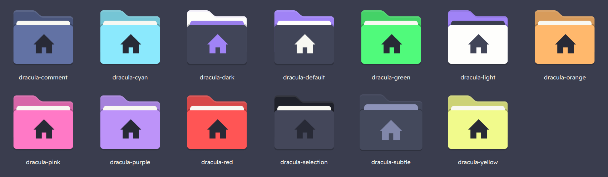

 
# Dracula for [Papirus Folders](https://github.com/PapirusDevelopmentTeam/papirus-icon-theme)
> [Dracula](https://draculatheme.com/) themed papirus folder icons for the [Papirus folder icons](https://github.com/PapirusDevelopmentTeam/papirus-folders) script. 



## Install

1. Make sure You have [Papirus Icon Theme](https://github.com/PapirusDevelopmentTeam/papirus-icon-theme) installed (preferably in `~/.local/share/icons`)
2. Also, make sure you have the [papirus-folders script](https://github.com/PapirusDevelopmentTeam/papirus-folders) installed to your home via [this](https://github.com/PapirusDevelopmentTeam/papirus-folders#install) method.
3. Clone this repository and change to cloned directory:
    ```
    git clone https://github.com/dracula/papirus-folders
    cd papirus-folders
    ```
4. Run `cp -r Icons/* ~/.local/share/icons/Papirus` from the repo's  directory if you have installed Papirus for the user. <br>
    If you have installed Papirus system-wide, run `sudo cp -r Icons/* /usr/share/icons/Papirus`.
5. Run '`papirus-folders -lv`' in the terminal to check whether the dracula-themed icon names are listed or not.
6. Now, you can set the folder icons you prefer using `papirus-folders` command (that you installed in *step 2*). You can check the steps to use it [here](https://github.com/PapirusDevelopmentTeam/papirus-folders#script-usage). Here is an example: <br>
`papirus-folders -C dracula-default --theme Papirus`

## Team

This theme is maintained by the following person(s) and a bunch of [awesome contributors](https://github.com/dracula/foobar/graphs/contributors).

| [](https://github.com/Vibhav201) |
| ---------------------------------------------------------------------------------------------------------- |
| [Vibhav Sehrawat](https://github.com/Vibhav201)                                                               |

## Community

- [Twitter](https://twitter.com/draculatheme) - Best for getting updates about themes and new stuff.
- [GitHub](https://github.com/dracula/dracula-theme/discussions) - Best for asking questions and discussing issues.
- [Discord](https://draculatheme.com/discord-invite) - Best for hanging out with the community.


## License

[MIT License](./LICENSE) 
